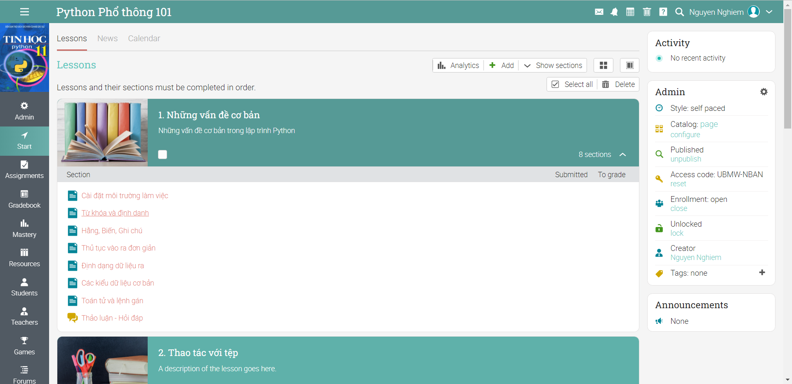

# Python Phổ thông

**Chương trình Tin học 11 hiện hành và Tin học lớp 10 chương trình mới (GDPT 2018)**\
Ngoài kiến thức được trình bày trong SGK Tin học 11, Khóa học còn bổ sung những kiến thức cần thiết khi giải quyết các vấn đề SGK đặt ra bằng ngôn ngữ lập trình Python. Đồng thời mở rộng, bổ sung, nâng cao để người học có thể vận dụng sức mạnh của Python trong công việc và giải quyết các bài toán tin học.\
Khóa học còn giúp người học viết một số ứng dụng, dự án thú vị phù hợp để triển khai, hướng dẫn học sinh trong nhà trường phổ thông.

Yêu cầu: Dành cho người lần đầu làm quen với Python



**Khóa học gồm 12 chủ đề:**\
1\. Những vấn đề cơ bản\
2\. Thao tác với tệp\
3\. Cấu trúc rẽ nhánh\
4\. Cấu trúc lặp\
5\. Thao tác với xâu\
6\. List và dữ liệu kiểu mảng\
7\. Các kiểu dữ liệu có cấu trúc\
8\. Chương trình con\
**Các chủ đề nâng cao**\
9\. Lỗi và Ngoại lệ\
10\. Lập trình hàm\
11\. Hướng đối tượng\
12\. Viết ứng dụng (hướng dẫn viết một số ứng dụng đơn giản)

## Lịch học

<mark style="color:purple;">**Học trên LMS:**</mark>

Học qua video bài giảng, bài đọc, làm bài tập, thực hành... trên LMS do học viên tự sắp xếp thời gian.

<mark style="color:purple;">**Học trực tuyến thời gian thực với giảng viên:**</mark>

### <mark style="color:orange;">Năm 2022</mark>

* [x] Python Phổ thông 102 (các buổi chiều Chủ nhật): Từ **17/4/2022**

### Năm 2021

* [ ] Python Phổ thông 101 (các buổi buổi chiều Chủ nhật): Từ **14/11/2021**
* [ ] Tập huấn giáo viên THPT lớp 2: 10/9/2021
* [ ] Tập huấn giáo viên THPT lớp 1: 06/9/2021
* [ ] Tập huấn giáo viên THCS lớp 2: 01/9/2021
* [ ] Tập huấn giáo viên THCS lớp 1: 25/8/2021

### Đăng ký học



### Tham gia nhóm Zalo: [https://zalo.me/g/uucxui948](https://zalo.me/g/uucxui948)
